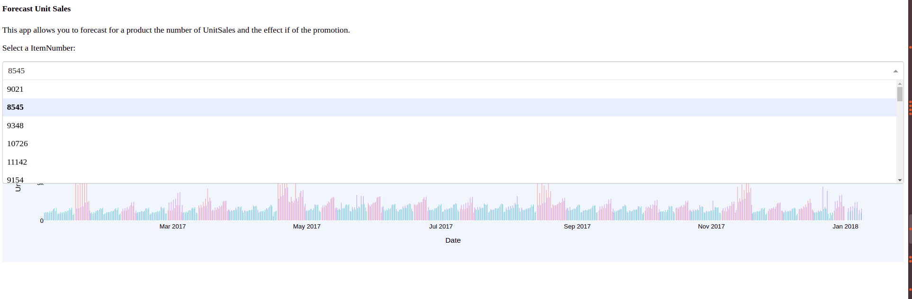
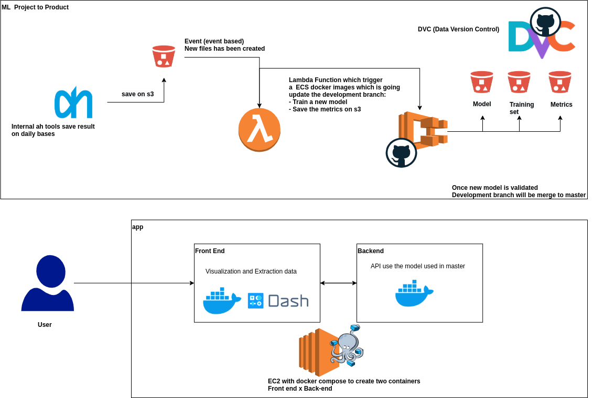

### Forecast Sales on a grocery store


They is 4 different steps in the project:

1. Introduction
2. Exploratory data analysis.
3. Model & Evaluation
4. App as Proof of context
5. Architecture to deploy in production


- ```git clone git@github.com:MatthieuRu/ ah-forecast-sales.git``` *Git clone the project from Github.*
- ```conda env create``` *Create the conda environment based on the environment.yml.*
- ```conda activate ah-forecast-sales``` *Activate the conda environment.*
- ```python app.py``` *Run the app to vizualise the results*
- ```jupyter notebook``` *To read and play with the two notebook*

### 1. Introduction

Before to start the project, the stakeholders of these project has discussed about the expected output of the package:

- A Proof of concept of a tool able to *forecast the number of demand for a specific product a week ahead*.

After the discussion, the output of the project should cover some topics:

1. Exploratory data analysis.
2. Working model and model evaluation.
3. A app to use as POC.
4. Next Step to deploy the solution in production

### 2. Explotary Data Analysis

#### Analysis

- None Values x Constante variables x Data Transformation
- Ditribution of the feature (Continuious and Categorical variables)
- Correlation between variables and UnitSales
- Product analysis

### 3. Model

#### **Research**

The decision has been taken to focus on the main library fbProphet for time series. The library has been developed by Facebook and provide good results. The aim is to start from the algorithm and then adjust the parameters and the model, to be able to improve the model based on the **same KPI**.

- a. Two Univariate Times Series for product promotion and not in promotion
- b. Multivariate Time Series with correlated variable (IsPromo)
- c. Multivariate Time Series with correlated variable (IsPromo and Communication Channel)
- d. Multivariate Time Series with correlated variable (Communication Channel) and do a logarithm transformation for UnitSales


#### **The evaluation of the model will be based on:**


We use NRMSE to be able to compare a model for all product. Because the RMSE is linked to scale of the UnitSales for a product.

- If the average of the UnitSales for a product A is 1000: a RMSE of 1000 will give a NRMSE of 1
- If the average of the UnitSales for a product B is 10: a RMSE of 10 will give a NRMSE of 1

#### **Results on our dataset**

Based on the NRMSE, the best model is:

*Multivariate Time Series with correlated variable (Communication Channel) and do a logarithm transformation for UnitSales*

<table border="1" class="dataframe">
  <thead>
    <tr style="text-align: right;">
      <th></th>
      <th>Algorithm</th>
      <th>SUM(NRMSE)</th>
    </tr>
  </thead>
  <tbody>
    <tr>
      <th>0</th>
      <td>univariate_NRMSE_2year</td>
      <td>68.674343</td>
    </tr>
    <tr>
      <th>1</th>
      <td>univariate_NRMSE_1year</td>
      <td>54.789562</td>
    </tr>
    <tr>
      <th>2</th>
      <td>multivariate_isPromo_NRMSE_2year</td>
      <td>70.769429</td>
    </tr>
    <tr>
      <th>3</th>
      <td>multivariate_isPromo_NRMSE_1year</td>
      <td>58.985069</td>
    </tr>
    <tr>
      <th>4</th>
      <td>multivariate_isPromo_CommunicationChannel_NRMSE_2year</td>
      <td>67.791203</td>
    </tr>
    <tr>
      <th>5</th>
      <td>multivariate_isPromo_CommunicationChannel_NRMSE_1year</td>
      <td>54.154700</td>
    </tr>
    <tr>
      <th>6</th>
      <td>multivariate_isPromo_CommunicationChannel_log_NRMSE_2year</td>
      <td>67.101639</td>
    </tr>
    <tr>
      <th>7</th>
      <td>multivariate_isPromo_CommunicationChannel_log_NRMSE_1year</td>
      <td>51.381017</td>
    </tr>
  </tbody>
</table>
</div>

### 4. App

The main goal of the app is to see a proof of concept how the model and the forecast can be used as a solution. You select your product and then you can get what will be the supply and demand for the next week.

Once you have run the command ```python app.py```. got to http://0.0.0.0:8050/



### 4. Deployement in Production

